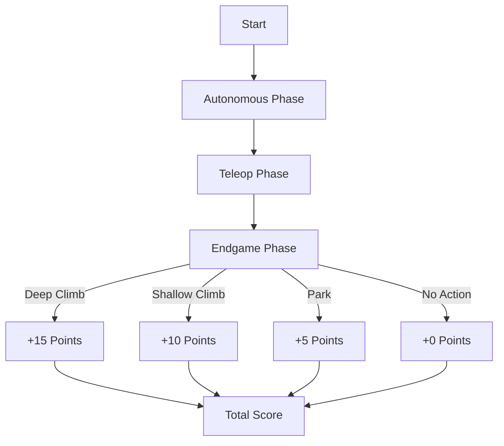
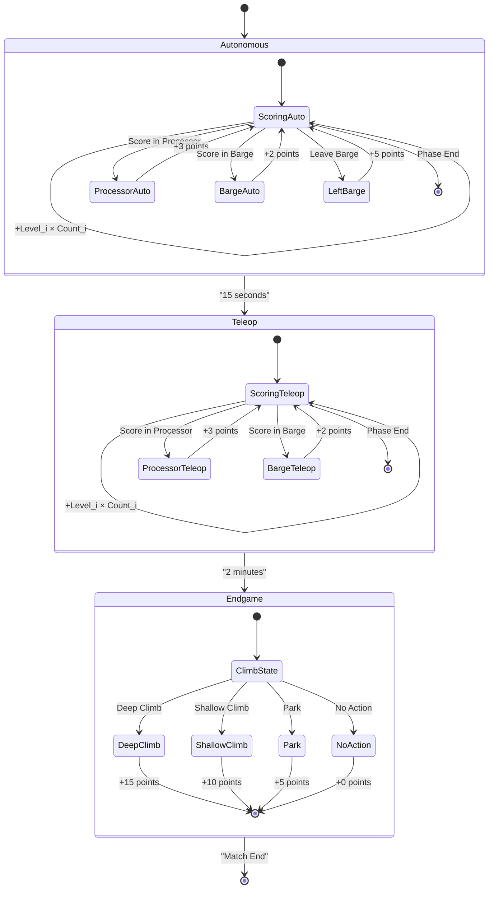
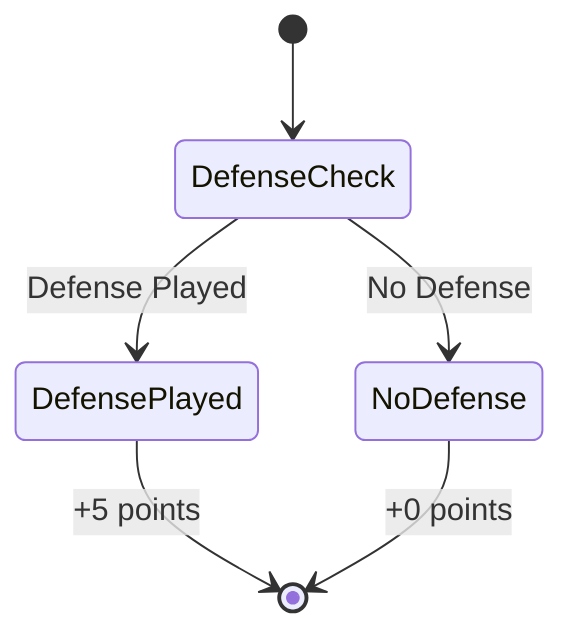
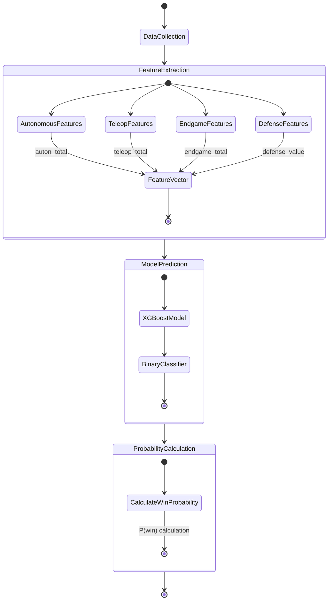
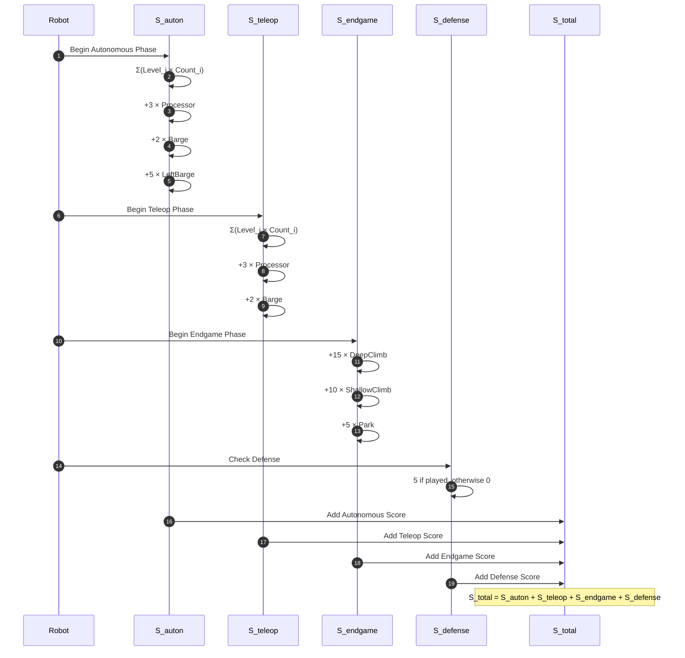
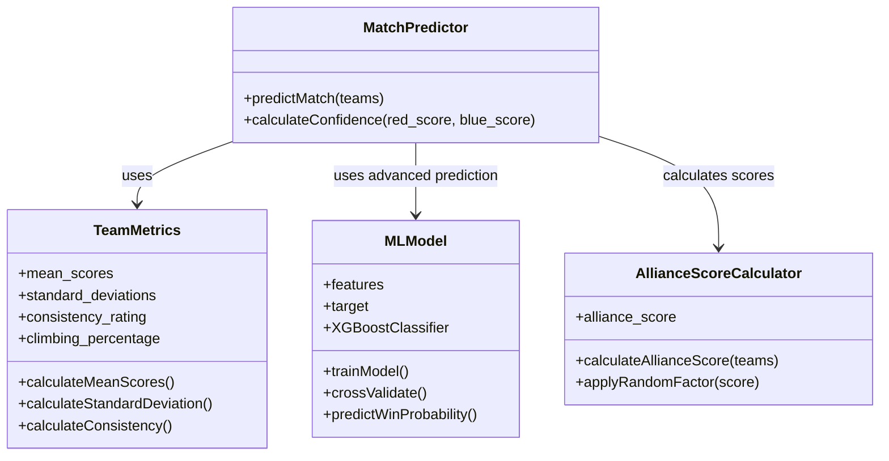

# Mathematics Behind the Match Predictor

This document explains the underlying mathematics and algorithms used in the PyIntel Scoutz Match Predictor, from basic scoring formulas to advanced machine learning techniques.

## Basic Scoring Formulas



### Phase Score Calculations

The scoring system breaks down robot performance into three phases, each with its own formula:

#### Autonomous Score

The autonomous score represents points earned during the 15-second autonomous period:

```math
S_{auton} = \sum_{i=1}^{4} (Level_i \times Count_i) + 3 \cdot Processor + 2 \cdot Barge + 5 \cdot LeftBarge
```

Where:
- `Level_i` represents the point value for scoring at level `i` (1-4)
- `Count_i` represents the count of items scored at level `i`
- `Processor` is the count of items scored in the processor (3 points each)
- `Barge` is the count of items scored on the barge (2 points each)
- `LeftBarge` is a boolean (1 if the robot left the barge, 0 otherwise) worth 5 points

#### Teleoperated Score

The teleoperated score represents points earned during driver control:

```math
S_{teleop} = \sum_{i=1}^{4} (Level_i \times Count_i) + 3 \cdot Processor + 2 \cdot Barge
```

#### Endgame Score

The endgame score represents points earned in the final phase of the match:

```math
S_{endgame} = 15 \cdot DeepClimb + 10 \cdot ShallowClimb + 5 \cdot Park
```

Where:
- `DeepClimb`, `ShallowClimb`, and `Park` are boolean values (1 if performed, 0 otherwise)

#### Defense Value

The defense contribution is calculated as:

```math
S_{defense} = \begin{cases} 
5 & \text{if defense is played} \\
0 & \text{otherwise}
\end{cases}
```

#### Total Score

The total score for a team in a match is the sum of all phase scores:

```math
S_{total} = S_{auton} + S_{teleop} + S_{endgame} + S_{defense}
```

## Statistical Analysis

### Team Performance Metrics

For each team, the following statistical measures are calculated using pandas GroupBy operations:

#### Mean Scores
```math
\mu_{phase} = \frac{1}{n} \sum_{i=1}^{n} S_{phase,i}
```

Where `phase` represents autonomous, teleop, endgame, or total scores, and `n` is the number of matches played.

#### Standard Deviation
```math
\sigma_{phase} = \sqrt{\frac{1}{n} \sum_{i=1}^{n} (S_{phase,i} - \mu_{phase})^2}
```

This measures the consistency of a team's performance.

#### Consistency Rating
```math
C_{team} = \frac{1}{\sigma_{total} + 1}
```

Adding 1 prevents division by zero and normalizes the consistency rating.

#### Climbing Percentage
```math
P_{climbing} = \frac{N_{climbs}}{N_{matches}} \times 100\%
```

Where:
- `N_climbs` is the number of matches where the team successfully climbed
- `N_matches` is the total number of matches played

### Alliance Score Calculation

For basic match prediction, the alliance score is the sum of team scores with a random factor:

```math
S_{alliance} = \sum_{team \in alliance} \mu_{total,team} \times RandomFactor
```

Where `RandomFactor` is a uniform random value between 0.9 and 1.1.

### Win Probability Calculation

The confidence in the prediction is calculated as:

```math
Confidence = \min\left(90, \frac{|S_{red} - S_{blue}|}{(S_{red} + S_{blue})/2} \times 100\%\right)
```

## Machine Learning Model

### XGBoost Classifier

The advanced prediction model uses XGBoost, an implementation of gradient boosted decision trees:

#### Feature Engineering

The ML model uses these features for each alliance:
- Total autonomous score (`auton_total`)
- Total teleop score (`teleop_total`)
- Total endgame score (`endgame_total`)
- Total defense value (`defense_value`)

#### Binary Classification Target

The target variable is a binary classifier:

```math
y = \begin{cases} 
1 & \text{if } S_{total} > \bar{S}_{total} \\
0 & \text{otherwise}
\end{cases}
```

Where `Ŝ_total` is the mean total score across all teams.

#### Model Training

The XGBoost model uses these parameters:
- `n_estimators = 200` (number of trees)
- `learning_rate = 0.1` (step size shrinkage)
- `max_depth = 6` (maximum tree depth)
- `random_state = 42` (for reproducibility)

#### Cross-Validation

A 5-fold cross-validation is used to evaluate model accuracy:

```math
CV_{score} = \frac{1}{5} \sum_{i=1}^{5} Acc_i
```

Where `Acc_i` is the accuracy score for the ith fold.

#### Prediction Probability

For match prediction, the model returns a probability for each alliance:

```math
P(win) = XGBModel.predict\_proba(features)[0][1] \times 100\%
```

## Text Analysis

### Sentiment Analysis

Comments from scouts undergo sentiment analysis using TextBlob:

```math
Sentiment = TextBlob(comment).sentiment.polarity
```

Where:
- Positive values indicate positive sentiment
- Negative values indicate negative sentiment
- Zero indicates neutral sentiment

## Visualization Mathematics

### Performance Breakdown Chart

The stacked bar chart follows this structure:
- X-axis: Team numbers
- Y-axis: Average score points
- Stacks:
  - Bottom: Autonomous scores
  - Middle: Teleop scores
  - Top: Endgame scores

### Consistency Rating Chart

The consistency chart uses a color gradient:

```math
Color = Colormap(C_{team} / max(C_{team}))
```

Where `Colormap` is a viridis color mapping function.

### Performance Gantt Chart

```mermaid
gantt
    title Match Prediction Processing Timeline
    dateFormat s
    axisFormat %S
    
    Data Loading            :a1, 0, 0.5s
    Team Filtering          :a2, after a1, 0.2s
    Feature Engineering     :a3, after a2, 0.8s
    Model Training          :a4, after a3, 2s
    Model Prediction        :a5, after a4, 0.1s
    Confidence Calculation  :a6, after a5, 0.05s
    Result Visualization    :a7, after a6, 0.5s
```



## Performance Optimization

### Data Structures

The application optimizes memory usage through:
- Pandas DataFrames for efficient data manipulation
- Dictionary-based team profiles for quick lookup
- Set-based filtered teams for O(1) membership checking

### Algorithmic Complexity

Key operations have these time complexities:
- Team data aggregation: O(n log n) where n is the number of matches
- Team filtering: O(m) where m is the number of teams
- Match prediction: O(1) after model training
- Model training: O(d * n * log(n)) where d is feature count and n is sample size

## Scoring Flowchart (Detailed)

```mermaid
flowchart LR
    Start((Start)) --> Auton["Autonomous Phase"]
    Auton --> AutonScore["S_auton = Σ(Level_i × Count_i) + 3×Processor + 2×Barge + 5×LeftBarge"]
    AutonScore --> Teleop["Teleop Phase"]
    Teleop --> TeleopScore["S_teleop = Σ(Level_i × Count_i) + 3×Processor + 2×Barge"]
    TeleopScore --> Endgame["Endgame Phase"]
    Endgame --> EndgameScore["S_endgame = 15×DeepClimb + 10×ShallowClimb + 5×Park"]
    EndgameScore --> Defense["Defense"]
    Defense --> DefenseScore["S_defense = 5 if played, else 0"]
    DefenseScore --> Total["Total Score: S_total = S_auton + S_teleop + S_endgame + S_defense"]
    Total --> End((End))
```



## Advanced Match Prediction Diagrams

### Match Scoring State Diagram

This state diagram shows the phases of a match and how scoring flows through each phase:



### Defense Value State Diagram



### Alliance Prediction Model

This diagram illustrates how the alliance prediction system processes team data:



### Score Calculation Sequence

This sequence diagram shows how the scores are calculated throughout a match:



### Prediction Metrics in Class Diagram



Note: Mathematical notation variables in the class diagram are represented as:
- In TeamMetrics: mean_scores (μ_phase), standard_deviations (σ_phase), consistency_rating (C_team), climbing_percentage (P_climbing)
- In AllianceScoreCalculator: alliance_score (S_alliance)

