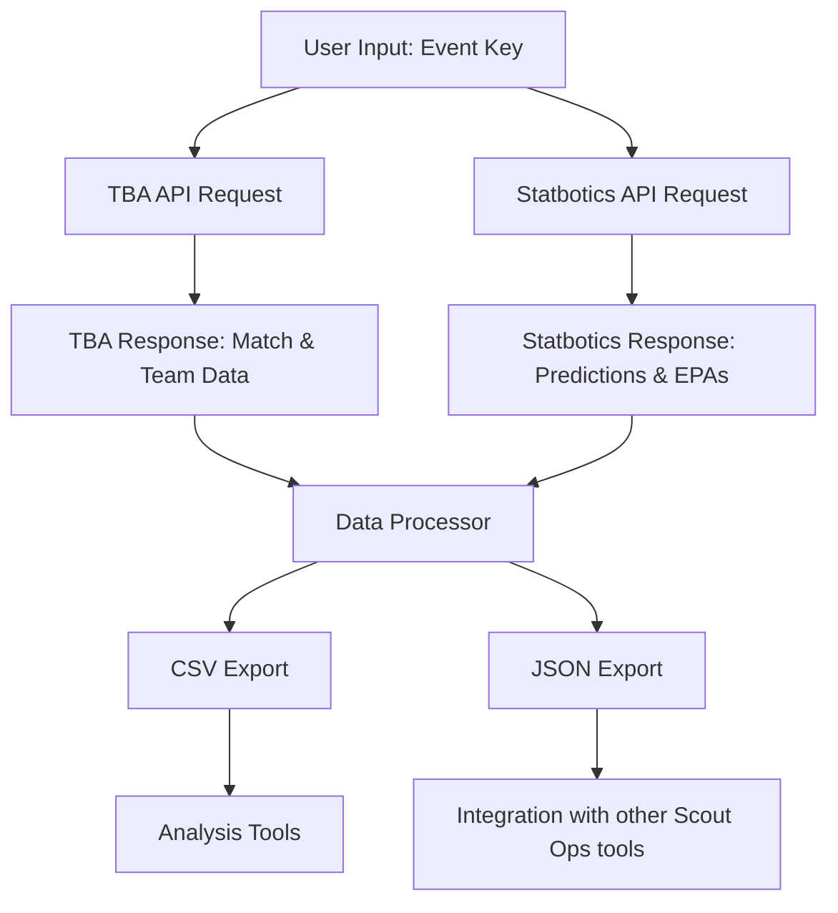

import { Callout } from 'nextra/components'

# Scout Ops Extractor API Integration

This document explains how Scout Ops Extractor integrates with external APIs to collect and process FRC competition data.

## API Overview

Scout Ops Extractor utilizes two primary data sources:

1. **The Blue Alliance (TBA)** - For official match data, team information, and event details
2. **Statbotics** - For advanced statistics and predictive metrics

These APIs provide complementary information that Scout Ops Extractor combines into a unified dataset.

## The Blue Alliance API

### API Details

- **Base URL**: `https://www.thebluealliance.com/api/v3`
- **Documentation**: [TBA API v3](https://www.thebluealliance.com/apidocs/v3)
- **Authentication**: API key required in HTTP header (`X-TBA-Auth-Key`)
- **Rate Limits**: 100 requests per minute
- **Data Format**: JSON responses

### Endpoints Used

Scout Ops Extractor utilizes the following TBA API endpoints:

| Endpoint | Purpose | Example Usage |
|----------|---------|---------------|
| `/event/{event_key}` | Get basic event information | `/event/2025miket` |
| `/event/{event_key}/teams` | List teams at an event | `/event/2025miket/teams` |
| `/event/{event_key}/matches` | Get match schedule & results | `/event/2025miket/matches` |
| `/event/{event_key}/rankings` | Get current rankings | `/event/2025miket/rankings` |
| `/event/{event_key}/alliances` | Get playoff alliances | `/event/2025miket/alliances` |
| `/event/{event_key}/oprs` | Get OPR/DPR/CCWM values | `/event/2025miket/oprs` |
| `/match/{match_key}` | Get detailed match information | `/match/2025miket_qm42` |
| `/team/frc{team_number}` | Get team details | `/team/frc201` |

### Request Headers

For all requests to the TBA API, Scout Ops Extractor uses the following header format:

```python
headers = {
    "X-TBA-Auth-Key": "YOUR_TBA_API_KEY"
}
```

<Callout type="info">
  Your personal API key is stored locally in the application configuration file and never shared with third parties.
</Callout>

## Statbotics API

### API Details

- **Base URL**: `https://api.statbotics.io/v3`
- **Documentation**: [Statbotics API](https://statbotics.io/api)
- **Authentication**: No authentication required
- **Rate Limits**: Unknown, but Scout Ops Extractor implements throttling
- **Data Format**: JSON responses

### Endpoints Used

Scout Ops Extractor utilizes the following Statbotics API endpoints:

| Endpoint | Purpose | Example Usage |
|----------|---------|---------------|
| `/event/{event_key}` | Get event statistics | `/event/2025miket` |
| `/team_events?event={event_key}` | Get team statistics at an event | `/team_events?event=2025miket` |
| `/matches?event={event_key}` | Get match predictions | `/matches?event=2025miket` |
| `/match/{match_key}` | Get match prediction | `/match/2025miket_qm42` |
| `/team/{team_number}` | Get team statistics | `/team/201` |

### Data Processing

Scout Ops Extractor processes the raw API data through several steps:

1. **Data Retrieval** - Fetching JSON data from both APIs
2. **Data Combination** - Merging data from both sources by common keys
3. **Data Transformation** - Converting nested JSON structures to flat CSV format
4. **Data Enhancement** - Calculating derived metrics not provided directly by the APIs

## Data Flow Architecture



## Error Handling

Scout Ops Extractor implements robust error handling for API interactions:

- **Connection Errors** - Automatic retry with exponential backoff
- **API Errors** - Detailed error messages with status codes
- **Data Inconsistencies** - Fallback to available data sources when one API fails
- **Rate Limiting** - Throttling of requests to stay within API limits

## API Response Caching

To minimize unnecessary API calls, Scout Ops Extractor implements caching:

- Event data is cached locally after the first retrieval
- Cache expiration varies by data type (team data: 24 hours, match data: 30 minutes)
- Force refresh option available to bypass cache

## Security Considerations

When using Scout Ops Extractor with these APIs:

- Store your TBA API key securely and never share it publicly
- Respect rate limits to avoid being temporarily blocked
- Be aware that cached data may not reflect real-time updates
- Use the application on trusted networks as API requests contain your key

## API Configuration

You can modify API-related settings in the application:

1. Change the TBA API key in the application interface
2. Adjust request timeouts in the configuration file
3. Modify cache expiration settings in the configuration file

## API Integration for Developers

If you're extending Scout Ops Extractor, the following client classes handle API interactions:

```python
# TBA API client
self.tba_client = BlueAllianceClient()
self.tba_client.headers["X-TBA-Auth-Key"] = api_key

# Statbotics API client
self.statbotics_client = StatboticsClient()

# Making API requests
event_data = self.tba_client.get_api_data(f"/event/{event_key}")
team_data = self.statbotics_client.get_api_data(f"/team/{team_number}")
```

For more details on the implementation, refer to the source code documentation.