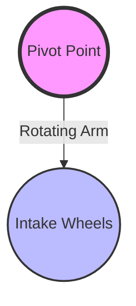

import Head from 'next/head';
import { Callout } from 'nextra/components';
import { GenericHero, GenericWidget, GenericGrid, ModernCard } from '../../../Components/index';

<Head>
    <title>Zero to Hero Episode 8: Advanced Simulation (AdvantageKit) - FEDS</title>
</Head>

<GenericHero
    title="Zero to Hero #8"
    titleColor="linear-gradient(135deg, #f59e0b 0%, #d97706 100%)"
    subtitle="The Matrix Reloaded: AdvantageKit 🦁"
    description="Standard simulation is cool. But what if you could replay a real match, change your code, and see if it would have fixed the bug? Welcome to AdvantageKit and the IO Layer architecture."
    backgroundType="gradient"
    backgroundValue="linear-gradient(135deg, #451a03 0%, #78350f 100%)"
    particles={[
        { symbol: '📼', transform: 'translate(0,0)' },
        { symbol: '⏪', transform: 'translate(10px,10px)' },
        { symbol: '🦁', transform: 'translate(-5px,15px)' }
    ]}
    buttons={[
        { text: '⬅️ Back to Ep 7', style: 'secondary', href: '/Tutorials/ZeroToHero/ZeroToHero7' },
        { text: 'AdvantageKit Docs', style: 'primary', href: 'https://github.com/Mechanical-Advantage/AdvantageKit' }
    ]}
    height="md"
    textAlign="center"
/>

## 🎯 The Problem with Standard Sim

WPILib simulation (Episode 8 Classic) is great for testing logic. But it has a flaw: **It's not deterministic.**
If you run the sim twice, your computer might lag slightly differently, causing different results.

**AdvantageKit** (by Team 6328) solves this. It separates your robot's **Inputs** (Sensors) from its **Logic** (Commands).
This allows you to:
1.  **Simulate**: Run code without a robot.
2.  **Log**: Record *every single input* during a match.
3.  **Replay**: Feed those inputs back into your code later to see exactly what happened.

---

## 🏗️ Chapter 1: The IO Layer Architecture

To use AdvantageKit, we must stop writing code like this:

```java
// ❌ The Old Way (Hard to Sim)
public class IntakeSubsystem extends SubsystemBase {
    private final CANSparkMax motor = new CANSparkMax(1, kBrushless);

    public void periodic() {
        // We are talking directly to hardware inside the logic!
        SmartDashboard.putNumber("Speed", motor.getEncoder().getVelocity());
    }
}
```

Instead, we create an **Interface** (The "IO" Layer) that sits between our Subsystem and the Hardware.

### Step 1: The Interface (`IntakeIO.java`)
This defines *what* the hardware can do, not *how* it does it.

```java
public interface IntakeIO {
    // A class to hold all our sensor data (The "Inputs")
    public static class IntakeIOInputs {
        public double positionRad = 0.0;
        public double velocityRadPerSec = 0.0;
        public double appliedVolts = 0.0;
        public double currentAmps = 0.0;
    }

    // Update the inputs (Read from hardware)
    public default void updateInputs(IntakeIOInputs inputs) {}

    // Send commands (Write to hardware)
    public default void setVoltage(double volts) {}
}
```

---

## 🔌 Chapter 2: The Implementations

Now we make two versions of the hardware: **Real** and **Sim**.

### Step 2: The Real Hardware (`IntakeIOReal.java`)
```java
public class IntakeIOReal implements IntakeIO {
    private final CANSparkMax motor = new CANSparkMax(1, kBrushless);

    @Override
    public void updateInputs(IntakeIOInputs inputs) {
        inputs.positionRad = motor.getEncoder().getPosition();
        inputs.velocityRadPerSec = motor.getEncoder().getVelocity();
        inputs.appliedVolts = motor.getAppliedOutput() * motor.getBusVoltage();
        inputs.currentAmps = motor.getOutputCurrent();
    }

    @Override
    public void setVoltage(double volts) {
        motor.setVoltage(volts);
    }
}
```

### Step 3: The Simulation (`IntakeIOSim.java`)
```java
public class IntakeIOSim implements IntakeIO {
    // Physics Model
    private final FlywheelSim sim = new FlywheelSim(DCMotor.getNEO(1), 2.0, 0.01);
    private double appliedVolts = 0.0;

    @Override
    public void updateInputs(IntakeIOInputs inputs) {
        sim.update(0.02); // Step physics forward 20ms

        inputs.positionRad += sim.getAngularVelocityRadPerSec() * 0.02;
        inputs.velocityRadPerSec = sim.getAngularVelocityRadPerSec();
        inputs.appliedVolts = appliedVolts;
        inputs.currentAmps = sim.getCurrentDrawAmps();
    }

    @Override
    public void setVoltage(double volts) {
        this.appliedVolts = volts;
        sim.setInputVoltage(volts);
    }
}
```

---

## 🧠 Chapter 3: The Subsystem (Logic)

Now the Subsystem doesn't care if it's real or simulated. It just talks to the `IO` layer.

```java
public class IntakeSubsystem extends SubsystemBase {
    private final IntakeIO io;
    private final IntakeIOInputsAutoLogged inputs = new IntakeIOInputsAutoLogged();

    // Constructor injects the correct IO version
    public IntakeSubsystem(IntakeIO io) {
        this.io = io;
    }

    @Override
    public void periodic() {
        // 1. Read Inputs from IO
        io.updateInputs(inputs);

        // 2. Log Inputs (AdvantageKit magic!)
        Logger.processInputs("Intake", inputs);

        // 3. Use Inputs for Logic
        if (inputs.velocityRadPerSec > 50) {
            System.out.println("Intake is fast!");
        }
    }

    public void runVolts(double volts) {
        io.setVoltage(volts);
    }
}
```

---

## 🎨 Chapter 4: Visualizing with Mechanism2d

Numbers are boring. Let's make a cool 2D visualization that works in AdvantageScope. This creates a "stick-figure" drawing of your mechanism that moves in real-time.



We do this inside the Subsystem, so it works for both Real Matches and Simulation!

```java
// Inside IntakeSubsystem.java
public class IntakeSubsystem extends SubsystemBase {
    // ... define inputs and io ...

    // 1. Create the Mechanism2d Canvas (Width x Height)
    private final Mechanism2d mechanism = new Mechanism2d(3, 3);

    // 2. Create the "Root" (The pivot point)
    private final MechanismRoot2d root = mechanism.getRoot("IntakePivot", 1.5, 1.5);

    // 3. Create the moving part ("Ligament")
    // Name, Length, Initial Angle
    private final MechanismLigament2d arm = root.append(
        new MechanismLigament2d("IntakeArm", 1.0, 0)
    );

    @Override
    public void periodic() {
        io.updateInputs(inputs);
        Logger.processInputs("Intake", inputs);

        // 4. Update the visual with REAL data
        // We convert radians to degrees because Mechanism2d uses degrees
        arm.setAngle(Units.radiansToDegrees(inputs.positionRad));

        // 5. Log the Mechanism2d object to AdvantageKit
        Logger.recordOutput("IntakeMechanism", mechanism);
    }
}
```

<GenericWidget title="How to View in AdvantageScope" variant="outlined">
    <GenericGrid layout="responsive" columns={{ xs: 1, md: 3 }} gap="16px" items={[
        {
            title: "Step 1",
            description: "Open your log file (or connect to Sim) in AdvantageScope."
        },
        {
            title: "Step 2",
            description: "Drag the 'IntakeMechanism' field from the sidebar into the main window."
        },
        {
            title: "Step 3",
            description: "Select 'Mechanism 2D' from the popup menu. Watch it move!"
        }
    ]}
    renderItem={(item) => <ModernCard {...item} variant="glass" />}
    />
</GenericWidget>

---

## 🚀 Chapter 5: RobotContainer (The Switch)

In `RobotContainer`, we decide which version to use based on whether we are simulating.

```java
public class RobotContainer {
    private final IntakeSubsystem intake;

    public RobotContainer() {
        if (Robot.isReal()) {
            // We are on the RIO
            intake = new IntakeSubsystem(new IntakeIOReal());
        } else {
            // We are on a Laptop
            intake = new IntakeSubsystem(new IntakeIOSim());
        }
    }
}
```

---

## 📊 Chapter 6: Deep Dive into AdvantageScope

AdvantageScope is the companion app for AdvantageKit. While the default WPILib Shuffleboard is great for live matches, AdvantageScope is built for forensics—analyzing data frame-by-frame. It is a mandatory install for working with AdvantageKit logs (`.wpilog`).

### ⚙️ The Mechanism Tab

The Mechanism Tab is where the magic from Chapter 4 happens. It displays jointed mechanisms created with one or more `Mechanism2d` objects.

*   **How to add**: Drag a `Mechanism2d` field (like `IntakeMechanism`) from the sidebar to the control pane.
*   **Controls**: Use the Timeline Controls at the bottom to scrub through the match. You can pause, rewind, or slow down playback.
*   **Management**: Delete a mechanism using the X button, or hide it temporarily by clicking the eye icon.

### 🧰 Core Features

AdvantageScope handles almost every data type a robot produces.

<GenericWidget title="AdvantageScope Features" variant="gradient">
    <GenericGrid layout="responsive" columns={{ xs: 1, sm: 2 }} gap="16px" items={[
        { title: "3D Field", icon: "🏟️", description: "Replay the match in 3D. Visualize robot pose, vision targets, and game pieces." },
        { title: "Line Graph", icon: "📉", description: "Drag distinct fields (PID errors, velocity, voltage) to compare them over time." },
        { title: "Mechanism 2D", icon: "⚙️", description: "Visualize the 'stick figure' robot we built in Chapter 4." },
        { title: "Console", icon: "💬", description: "Review standard output and error logs synchronized with the match timeline." },
        { title: "Swerve Visualizer", icon: "🦀", description: "See individual module vectors to debug drive issues." },
        { title: "Live & Offline", icon: "🛜", description: "Connect live to the robot for tuning, or load a log file for post-match analysis." }
    ]}
    renderItem={(item) => <ModernCard {...item} variant="elevated" size="sm" />}
    />
</GenericWidget>

---

## 🏁 Summary

You have now separated **Hardware** from **Logic**.

*   **IO Layer**: The bridge between code and reality.
*   **AdvantageKit**: The logger that records the traffic on that bridge.
*   **Mechanism2d**: The tool to verify your physics visually.
*   **AdvantageScope**: The visualizer to replay the past.

In **Episode 9**, we will use this architecture to build a **Concept Robot** from scratch, integrating Swerve, Elevators, and Shooters into one cohesive system!

---

## 📞 Need Help?

*   **AdvantageKit Docs**: [github.com/Mechanical-Advantage/AdvantageKit](https://github.com/Mechanical-Advantage/AdvantageKit)
*   **Email**: feds.programming@gmail.com

<Callout type="info" emoji="🦁">
    **Fun Fact**: AdvantageKit was created by Team 6328 Mechanical Advantage. It is now used by hundreds of teams, including World Champions. It is the gold standard for FRC software.
</Callout>

